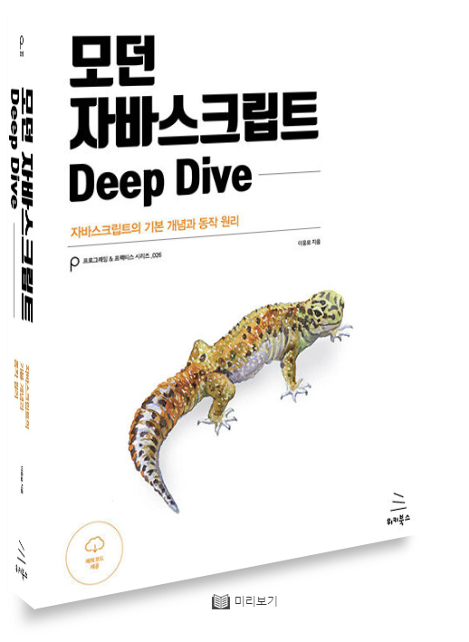

# 📒 모던 자바스크립트 DeepDive 완독 스터디

   
  
   

### 📆 When ?
- 매주 월요일 오후 8시

### 📕 What ?
- 매주 하나의 Chapter를 읽고 정리하여 Github에 올린다. 
- 자신이 맡은 부분을 잘 정리하여 발표한다.
- 자유롭게 토론한다.

### ❓ Why ?
- 좋은 코드를 짜는 개발자가 되기 위하여!
- 면접에 대비하여 미리 자바스크립트의 문법과 동작을 이해한다.

| [이창훈](https://github.com/anotheranotherhoon) | [정환민](https://github.com/JEONGHWANMIN) | [한성욱](https://github.com/StarryPro) | [박태휘](https://github.com/tahupapa) |[김현호](https://github.com/ryan-kim-dev)|
| :---: | :---: | :---: | :---: | :---: |
|  |  |  |  |  |
